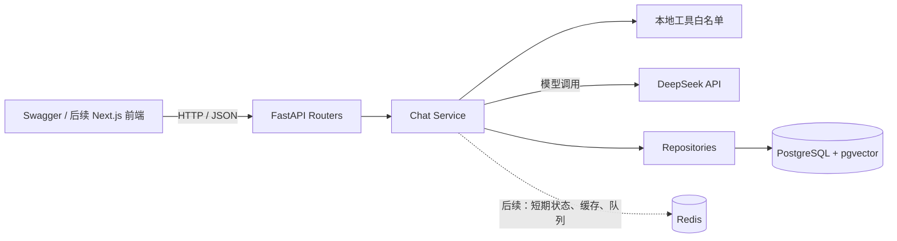

# 当前 Agent 应用架构

```mermaid
flowchart LR
    client[Swagger / 后续 Next.js 前端]
    router[FastAPI Routers]
    service[Chat Service]
    tools[本地工具白名单]
    model[DeepSeek API]
    repo[Repositories]
    postgres[(PostgreSQL + pgvector)]
    redis[(Redis)]

    client -->|HTTP / JSON| router
    router --> service
    service --> tools
    service -->|模型调用| model
    service --> repo
    repo --> postgres
    service -.->|后续：短期状态、缓存、队列| redis
```