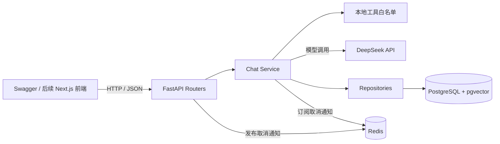
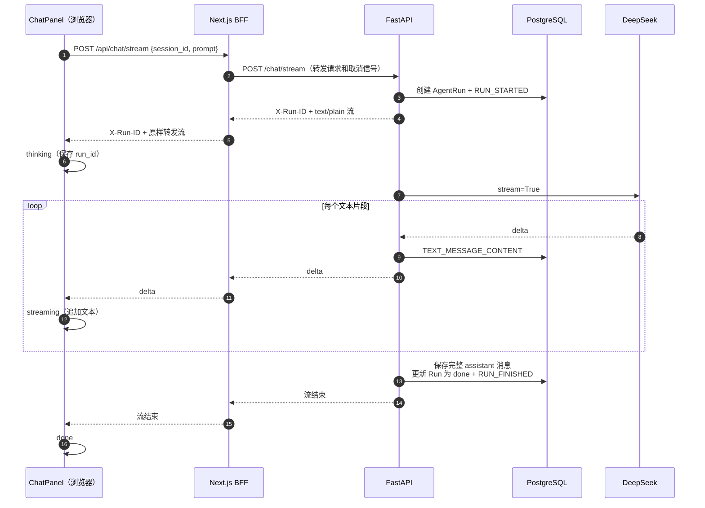
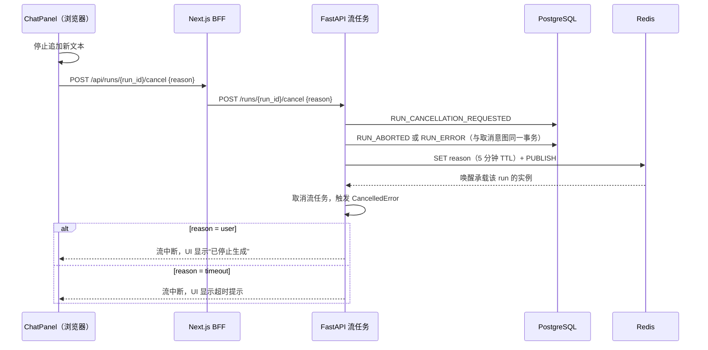
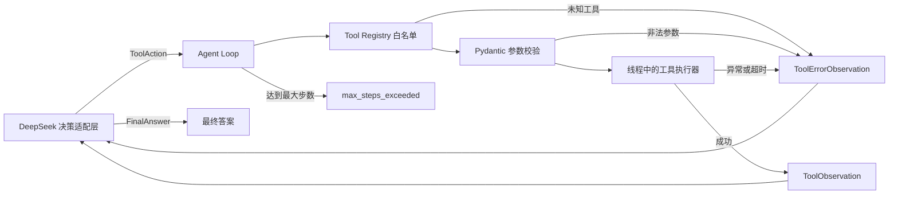

# 当前 Agent 应用架构

## 流式聊天与运行事件流

### 取消信号传播

## Agent Runtime（当前阶段）

当前已实现 `Agent Loop → Registry → 参数校验 → 工具执行 → Observation`。DeepSeek 决策适配层仍是下一课，正式接入前 `/tool-test` 继续保留原有的两次模型调用演示。

运行时边界：

- 模型只能提出工具名和 JSON 参数，不能决定要执行的 Python 代码。
- 工具必须同时注册参数模型和执行器；未知工具与非法参数不会进入执行器。
- 同步工具在线程中运行，每个工具都有正数超时；普通异常会被转换为安全错误，取消则继续向上传播。
- 每次决策或工具结果后都重新进入循环，直到得到最终答案或达到最大步数。
