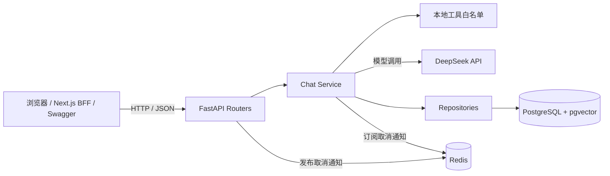
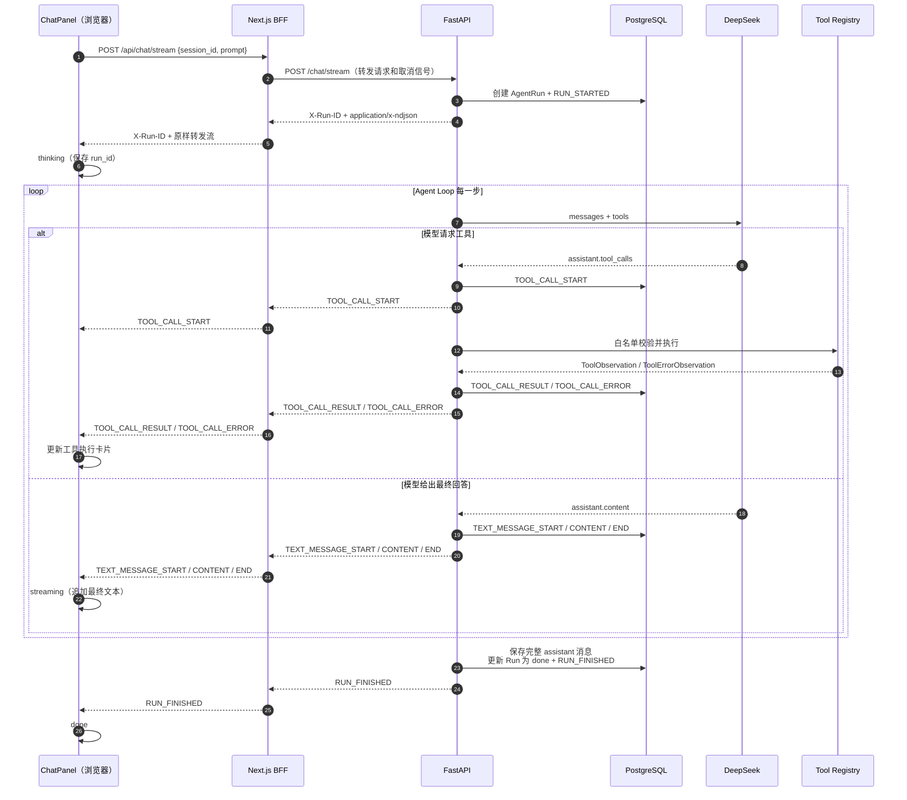
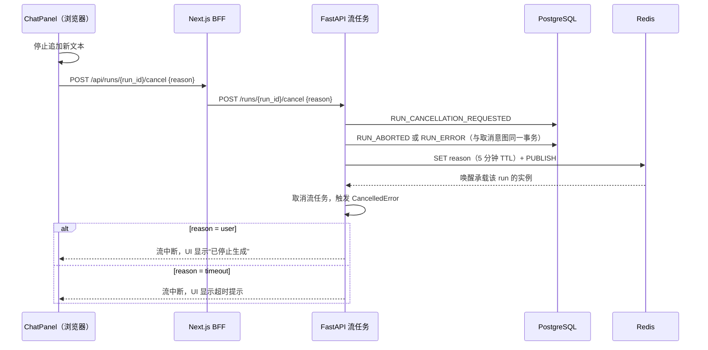
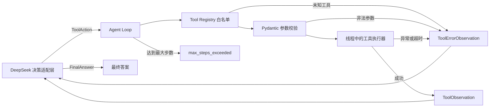

# 当前 Agent 应用架构



## 流式聊天与运行事件流



### 取消信号传播



## Agent Runtime（当前阶段）



当前已经实现 DeepSeek 决策适配层、完整循环和领域事件流。`POST /tool-test` 通过 `run_agent_loop` 获取兼容的最终结果；正式 `POST /chat/stream` 消费 `stream_agent_loop`，把工具开始、成功、失败与循环终态转换成可持久化、可传输的 NDJSON 事件。

```mermaid
sequenceDiagram
    autonumber
    participant API as POST /tool-test
    participant Decision as DeepSeekDecisionMaker
    participant LLM as DeepSeek
    participant Loop as Agent Loop
    participant Tool as Tool Registry

    API->>Loop: run_agent_loop(decision_maker)
    Loop->>Decision: decide(())
    Decision->>LLM: system + user + tools
    LLM-->>Decision: assistant.tool_calls
    Decision-->>Loop: ToolAction
    Loop->>Tool: 白名单解析、参数校验、执行
    Tool-->>Loop: ToolObservation / ToolErrorObservation
    Loop->>Decision: decide(累计 observations)
    Decision->>LLM: assistant.tool_calls + tool(tool_call_id, content)
    LLM-->>Decision: assistant.content
    Decision-->>Loop: FinalAnswer
    Loop-->>API: completed + answer + observations
```

适配层只负责供应商消息协议与 Runtime 决策之间的转换，不执行工具、不跳过白名单，也不解析或修复模型参数。当前采用每轮一个工具的顺序策略；如果模型一次请求多个工具，适配层会显式拒绝，避免静默丢弃调用。

运行时边界：

- 模型只能提出工具名和 JSON 参数，不能决定要执行的 Python 代码。
- 工具必须同时注册参数模型和执行器；未知工具与非法参数不会进入执行器。
- 同步工具在线程中运行，每个工具都有正数超时；普通异常会被转换为安全错误，取消则继续向上传播。
- 每次决策或工具结果后都重新进入循环，直到得到最终答案或达到最大步数。
- Runtime 只产生领域事件，不依赖 HTTP；Chat Service 负责事件落库和 NDJSON 编码，浏览器负责网络分块重组与状态渲染。
