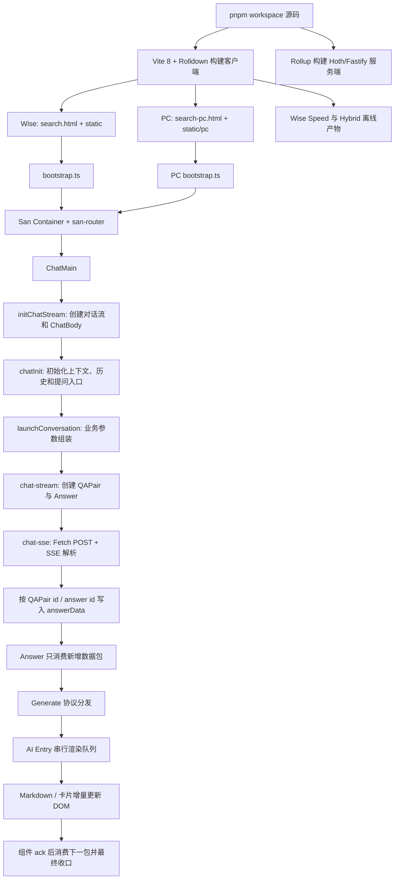
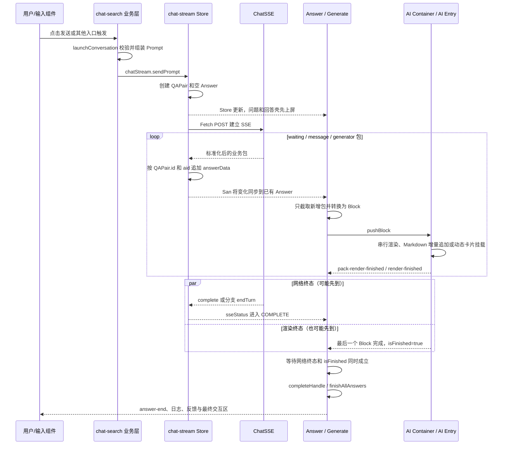

# ChatSearch 项目总览与全链路

> 这是一份“分层使用”的面试讲稿，不需要从头背到尾。先用速讲版建立项目认知，面试官追问后再进入对应专题；代码级状态、伪代码和改进方案统一放在深挖区。

## 0. 怎么使用这份文档

| 面试场景 | 建议阅读范围 | 目标 |
|---|---|---|
| 30 秒自我介绍项目 | 本页“30 秒项目介绍” | 说清业务、技术栈和核心链路 |
| 3～5 分钟项目讲解 | 第一部分“项目全链路”＋选择两个核心专题 | 先把架构讲完整，再突出个人技术价值 |
| 面试官追问实现 | 第二部分对应专题 | 按“问题—方案—边界”展开 |
| 追问状态机、伪代码 | 第三部分代码级深挖 | 给字段、判断顺序和竞争处理 |
| 临场查文件或指标 | 第四部分速查 | 快速找到代码和验证口径 |

### 内容标识

后文会区分三类内容，避免把现状和理想方案混在一起：

- **【当前实现】**：能在当前仓库代码中直接核对；
- **【协同方案】**：前端与 Native/服务端共同设计，但实现不完全在本仓库；
- **【改进建议】**：针对现状缺口给出的更严格方案，不能说成已经上线。

### 30 秒项目介绍

> 这是一个覆盖 PC、移动浏览器和百度 App WebView 的 AI 搜索与助手项目，使用 San.js、TypeScript 和 pnpm monorepo。核心链路是用户提问、SSE 流式返回、结构化答案渲染以及回答完成。项目的技术复杂度一部分来自网络、DOM、用户操作和 Native 预加载的并发状态，另一部分来自大型前端应用的构建与首屏性能，所以我重点讲多分支一致性、流式请求恢复、渲染背压、Hybrid 首屏和 Vite 构建体系。

### 两条核心链路

页面启动链回答“整个页面怎么出现”：

```text
/search HTML（head 注入 frameBaseData，body 只有 #app）
  → bootstrap 读取启动数据并 attach 根组件
  → san-router 挂载 Home / ChatMain
  → ChatMain 创建 ChatStream 和 ChatBody
  → chatInit 选择引导页、历史页、query 新会话或 frame 预加载
```

单轮回答链回答“一次问题怎么流式进入 DOM”：

```text
用户输入
   ↓
创建 QAPair
   ↓
SSE 持续返回 waiting / thinking / markdown / card / endTurn
   ↓
按轮次和分支写入 Store
   ↓
渲染队列消费并等待组件 ack
   ↓
回答收口、日志和反馈交互
```

### 难点总览

| 专题 | 面试中先说什么 | 当前核心方案 | 必须主动说明的边界 |
|---|---|---|---|
| SSE 选型 | 业务是“一问一答”的服务端单向流 | Fetch SSE、POST、Header、Abort | WebSocket 也要自己解决顺序和恢复 |
| 双答案 | 一条流交叉返回 A/B，分支完成不等于整轮完成 | `compareIdx` 路由＋网络/渲染双屏障＋幂等收口 | 停止、异常和正常完成必须区分 |
| SSE 恢复 | 旧回调会污染新轮次，checkpoint 还有确认点问题 | QAPair id 绑定＋`seq_id` 续传 | 当前是 best-effort，不是真正 exactly-once |
| DOM 背压 | SSE 到达不等于用户已看到 | 串行消费队列＋组件 ack＋结束屏障 | 空包、错误包也必须释放队列 |
| Hybrid | 本地静态资源快，但用户动态数据不能固化 | 离线包＋BaseData SWR＋初始化屏障 | Native 更新属于协同方案；现状与设计稿要分开讲 |
| Vite 构建 | 构建慢、首屏包大、本地联调依赖开发机 | Vite/Rolldown＋分包/懒加载＋本地 Mock/代理 | 历史收益数字有专项口径，不能当作当前全量实测 |

### 推荐主讲顺序

优先讲两个最能体现深度的难点，再根据面试官方向扩展：

1. 双答案一致性：体现状态机、幂等和多分支收口；
2. SSE 与 DOM 背压：体现生产者/消费者和动态渲染；
3. SSE 恢复：面试官关注网络可靠性时展开；
4. Hybrid：面试官关注性能、端内架构或缓存时展开；
5. Vite 构建：面试官关注工程化、构建性能或前端基础设施时展开。

---

# 第一部分：项目全链路与页面渲染

> 这一部分先回答两个问题：项目整体怎么跑起来，以及页面究竟在哪几个时刻完成了什么渲染。后面的 SSE、双答案、Hybrid 和渲染背压，都是这条主链上的局部难点。

## 1. 先用一张图建立整体认知



整个项目不是一个组件完成所有事情，而是有四层明确分工：

| 层次 | 主要包或模块 | 负责什么 | 不负责什么 |
|---|---|---|---|
| 页面业务层 | `packages/chat-search` | 页面入口、路由、登录、上下文、请求业务参数、Answer 业务展示 | 不直接解析底层 SSE 字节流 |
| 对话流层 | `packages/chat-stream` | QAPair 数据模型、当前轮次、请求状态、历史、停止和重试 | 不理解 Markdown 和具体卡片如何渲染 |
| 网络协议层 | `packages/chat-sse` | Fetch SSE、事件解析、协议状态、Abort、序号和性能数据 | 不操作 DOM，也不决定 UI 展示哪种卡片 |
| 结构化渲染层 | `chat-search/answer-generate`＋`packages/chat-huabu` | 把 generator 协议转成 Markdown、思考、引用和动态卡片并增量渲染 | 不发起对话请求 |

这种分层的价值是：网络协议变化主要收敛在 `chat-sse`，会话状态变化收敛在 `chat-stream`，业务样式和卡片变化主要收敛在 `chat-search/chat-huabu`，不会让一个超大组件同时维护请求、状态和 DOM。

## 2. 先分清楚：这个页面不是“一次渲染完成”的

面试中如果直接说“请求回来以后 San 渲染页面”，会把四段完全不同的工作混在一起。更准确的划分是：

| 阶段 | 触发时机 | 这一阶段产出什么 | 还没有什么 |
|---|---|---|---|
| 文档壳与启动数据 | 浏览器请求 `/search` | HTML、`frameBaseData`、客户端入口脚本、空的 `#app` | 没有主要业务 DOM |
| 应用骨架渲染 | Bundle 执行并 attach 根组件 | PC 侧栏/移动端容器、路由挂载点、全局弹层等 | 还不一定有会话内容 |
| 首屏业务渲染 | 路由和 `chatInit` 判断页面场景 | 首页、历史会话、带 query 的新会话或 frame 预加载页 | query 场景的回答可能仍在生成 |
| 单轮回答增量渲染 | SSE 包持续写入 `answerData` | 问题、Markdown、思考过程、引用、动态卡片逐步进入 DOM | 收到 `endTurn` 也不代表 DOM 已完成 |

因此，`frameBaseData`、San attach、首屏数据初始化和 SSE 增量回答不是同一个“渲染步骤”。它们之间的完整关系是：

```text
服务端返回 HTML 壳和启动数据
        ↓
客户端入口创建根组件和路由骨架
        ↓
路由选择首页 / 对话页 / 历史页 / frame 页
        ↓
对话页创建 ChatStream 与 ChatBody
        ↓
首屏初始化决定：展示引导、恢复历史，还是自动发起 query
        ↓
每轮 SSE 只追加数据；Answer → Generate → AI Entry 增量修改 DOM
        ↓
网络结束并且渲染队列清空后，才算这一轮视觉完成
```

### 2.1 五类状态分别放在哪里

页面能够稳定运行，不是靠一个“大 Store”，而是不同生命周期的数据放在不同容器：

| 状态层 | 真实载体 | 典型数据 | 为什么不能混在一起 |
|---|---|---|---|
| 启动数据 | HTML 中的 `aiTabFrameBaseData`，读取后进入内存缓存 | token、lid、用户、实验、模型、`chatParams` | 属于本次文档启动契约，普通 Web 在组件挂载前同步可读 |
| 页面业务状态 | `botStore` | rank、session、模型、皮肤、工作区、页面环境 | 首页、对话页和 Hybrid 初始化都会使用，生命周期长于单轮回答 |
| 对话实体状态 | `chat-stream` 自己的 San Store | `chatStreamData`、QAPair、Answer、当前请求与 SSE 实例 | 需要按稳定 QAPair 管理多轮会话，不能依赖某个页面组件是否重建 |
| 渲染状态 | Answer、Generate、AI Entry 的组件 Data | `cacheList`、`queue`、`currentIndex`、`prevBlockRenderFinished` | 反映 DOM 消费进度，不应该反向冒充网络完成状态 |
| 交互状态 | 页面/Answer 局部 Data 与业务 Store | 当前浏览列、输入态、停止态、反馈卡、弹层 | 用户浏览哪一列不能决定网络包写入哪一列 |

最关键的边界是：**网络状态描述“数据有没有到”，渲染状态描述“用户有没有看见”，交互状态描述“用户现在能做什么”**。双答案、停止生成和反馈卡的很多问题，都是因为把这三者合成了一个 `status`。

## 3. 构建期：源码如何变成可以访问的页面

### 3.1 Monorepo 不是一个“大包”，而是多个职责包协同

项目使用 pnpm workspace。主应用是 `packages/chat-search`，但它通过 workspace 依赖复用了：

- `chat-stream`：对话流 SDK；
- `chat-sse`：流式请求 SDK；
- `chat-huabu`：Markdown、思考过程和结构化卡片；
- `chat-input-next`：输入框；
- `chat-util`：环境、Bridge、DOM 和请求等公共能力；
- 若干独立工作台：通过 qiankun 或独立入口按场景加载。

因此构建时 Vite 会从 `chat-search` 的 HTML 入口出发，把 workspace 包的源码一起纳入依赖图，而不是先手工把每个包复制进主应用。

### 3.2 为什么客户端要分 Wise、PC 和 Wise Speed 多次构建

`package.json` 的主构建实际是：

```text
清空 dist
  → pnpm prod             构建 Wise
  → pnpm prod-pc          构建 PC
  → pnpm prod-wise-speed  构建加速入口
  → pnpm prod_server      构建服务端
```

不能只构建一次、运行时再判断平台，主要原因是 PC 与 Wise 的 Cosmic 组件产物、文件后缀优先级和静态目录都不同。构建期通过 `PLATFORM` 选择：

| 构建类型 | HTML/JS 入口 | 资源目录 | 关键差异 |
|---|---|---|---|
| Wise | `search.html`、`share.html` | `static/` | 优先解析 `.wise.san`、移动端 Cosmic |
| PC | `search-pc.html`、`share-pc.html` | `static/pc/` | 优先解析 `.pc.san`、PC Cosmic |
| Wise Speed | `inline-bootstrap.ts` | 专用加速产物 | 给预渲染首屏使用，尽量减少独立请求 |

Wise 第一次构建会清空 `dist`，PC 和 Wise Speed 在其后追加产物，避免后一次构建把前一次平台产物删除。

### 3.3 Vite、Rolldown 与 Rollup 在这个项目里的实际位置

- 浏览器端使用 Vite 8，当前配置已经通过 `rolldownOptions` 使用 Rolldown/OXC 构建链；
- Vite 负责开发服务器、HTML 入口、San 单文件组件、模块依赖图、静态资源和客户端分包；
- Hoth/Fastify 服务端仍由单独的 Rollup 配置构建；
- 所以不能简单说“整个项目都由 Vite 构建”，准确说法是“客户端由 Vite/Rolldown 构建，Node 服务端仍走 Rollup”。

### 3.4 构建阶段做了哪些运行时优化

Vite 配置中的关键工作包括：

1. San 插件把 `.san` 模板、脚本和样式编译为浏览器模块；
2. Alias 在构建期把 Cosmic 指向 PC 或 Wise 对应实现；
3. `advancedChunks` 把 San 基础设施、Markdown、高亮、图表和大型 Cosmic 包拆成相对稳定的 chunk；
4. 高频动态模块通过 `modulepreload` 提前加载，低频页面和卡片仍保持懒加载；
5. 正式环境使用带 hash 的 CDN 资源，远程联调构建不压缩、可不带 hash，便于调试；
6. `target: es2015` 只处理语法兼容，必要的运行时 polyfill 在 `base.ts` 显式引入；
7. Hybrid 插件额外生成离线包和 manifest，Wise Speed 插件生成预渲染加速入口。

构建完成后，服务端的作用主要是提供页面模板、静态资源服务和少量服务端接口。AI 回答的生成不在这个前端 Node 进程里完成，而是由浏览器请求对话服务。

## 4. 文档启动：用户打开 URL 后发生了什么

### 4.1 HTML 是真正的启动入口

这里不能只说“生产环境会注入 BaseData”，准确链路是：用户访问公开的 `/search` 页面路由，服务端页面层返回 HTML 文档，并在返回前把本次请求对应的 `frameBaseData` 序列化进 `<head>`。

```text
GET /search?word=...
        ↓
服务端页面层计算本次请求的 frameBaseData
        ↓
返回 Content-Type: text/html
        ↓
<head>
  <script type="application/json" name="aiTabFrameBaseData">
    {token, lid, userInfo, chatParams, sample, usableModel, path, ...}
  </script>
  <script type="module" src=".../search-*.js"></script>
</head>
<body>
  <div id="app"></div>
</body>
        ↓
客户端 JS 读取 JSON，初始化 Store，再把 San 页面挂到 #app
```

在 `wenxin.baidu.com/search` 的线上文档响应中可以直接验证：

- 状态码为 `200`，`Content-Type` 是 `text/html; charset=utf-8`；
- `<head>` 内存在 `<script type="application/json" name="aiTabFrameBaseData">`；
- JSON 中包含 token、lid、userInfo、chatParams、实验、模型配置，以及 `path: "/search"`；
- BaseData Script 后面才是 `search-*.js` 客户端入口；
- `<body>` 中的 `#app` 初始为空，具体页面由客户端 JavaScript 挂载。

因此术语上要说准确：

| 描述 | 是否准确 | 原因 |
|---|---|---|
| “`/search` 响应下发了 frameBaseData” | 准确 | 它在 `/search` 的 HTML 文档响应中 |
| “frameBaseData 写在 HTML 的 `<head>`” | 准确 | 使用 `application/json` Script 承载，不会作为 JS 执行 |
| “这个页面是 CSR” | 准确 | `#app` 初始为空，San 组件由客户端 Bundle 创建和挂载 |
| “frameBaseData 是 CSR 请求得到的” | 不够准确 | 它不是客户端启动后再发 XHR 获取，而是服务端先注入初始 HTML |
| “这是完整 SSR 页面” | 不准确 | 服务端没有输出主要业务 DOM，只输出 HTML 壳和初始化数据 |

最准确的表述是：**普通 Web 模式采用“服务端注入启动数据＋客户端 CSR 渲染”**。它既不是纯静态 CSR，也不是服务端把完整聊天页面渲染好的 SSR。

源码中的契约与线上响应能够对应上：

1. `search.html` / `search-pc.html` 在 `<head>` 预留 `<!--placeholder:vui-replace-head-content-->`；
2. 线上服务端页面层将其替换为 `aiTabFrameBaseData` JSON Script；
3. 本地开发没有线上页面层，所以 `vite-search-dev-plugin.ts` 会请求远端 `/search` 提取相同 JSON，再注入本地 HTML，模拟线上契约；
4. `getFrameBaseData()` 使用 `document.querySelectorAll('script[name="aiTabFrameBaseData"]')` 读取、`JSON.parse` 并写入内存缓存；
5. `store/index.ts` 在初始化时把 token、chatParams、sample、模型、开关等字段同步到 `botStore`；
6. `base.ts` 和后续 bootstrap 再基于这些数据初始化主题、字体、路由和页面组件。

Wise 的 `search.html` 和 PC 的 `search-pc.html` 还会完成三个入口职责：

1. 设置 `window.framePlatform`，让公共代码知道当前是 PC 还是 Wise；
2. 提供 `<div id="app"></div>` 作为 San 根节点；
3. 以 ES Module 加载对应的 `bootstrap.ts`。

Hybrid 与普通 Web 的差别在数据来源：离线 HTML 不能预埋某个用户的动态 BaseData，因此 Hybrid 场景改由 Native Bridge/动态接口异步提供，并在 ChatStream 初始化前增加数据就绪屏障。静态 JS 可以缓存，但登录态、实验、token、session 等动态数据必须按本次用户和请求确认。

### 4.2 bootstrap 只做全局初始化，不直接发送对话

Wise bootstrap 的关键顺序可以概括为：

```ts
import '../../base';           // polyfill、BaseData、body 环境
initEventBus();                // 全局事件通道
initChatExtension();           // 扩展能力
new Container().attach(app);   // 挂载 San 根容器
initCardChannel();             // 卡片通信
bindClickLog();                // 全局日志
```

PC 入口结构类似，只是根组件换成 `PCContainer`，并增加 PC 布局、PWA 和右侧工作区能力。

### 4.3 Container 用路由决定挂哪个页面

根容器 `attached` 后触发 `page-start`，注册 `san-router` 路由并执行 `router.start()`：

- Wise 的 `/`、`/search`、具体 session 路由最终进入 `ChatMain`；
- PC 首页与对话页分开，Chat 主页面还采用动态 import，首页空闲时会预加载 Chat chunk；
- 路由层只决定“显示哪个页面”，不直接管理一轮对话的数据。

### 4.4 ChatMain 先建立“视图骨架”，再初始化“业务上下文”

进入 ChatMain 后会触发 `chat-start`。代码顺序是先 `initChatStream()`、再 `chatInit()`：

```text
initChatStream()
  ├─ 注册 Question / Answer 组件
  ├─ 创建 ChatStream 实例和 chat-stream Store
  └─ 把 ChatBody attach 到页面
             ↓
chatInit()
  ├─ 注册 Native/H5 搜索事件
  ├─ 解析 URL 和搜索入口参数
  ├─ contextInit 初始化 session/rank
  ├─ 拉取引导语或历史
  └─ 条件满足时 launchConversation
```

先创建对话流实例，是为了保证随后初始化上下文、加载历史或自动发起首轮问题时，接收 QAPair 的 Store 和 ChatBody 已经存在。`chatInit` 内部仍包含异步请求，所以后续生命周期事件不一定全部严格串行。

Wise Hybrid 会在这之前 `await loadBaseData()`。这是一个初始化屏障：不能让请求先使用空 token 发出，再在稍后把 BaseData 补进 Store。

## 5. 应用骨架与首屏业务是怎样渲染的

### 5.1 PC 和 Wise 的根组件并不相同

两端共用对话能力，但页面骨架在构建期和运行期都做了区分：

```text
Wise
#app
└─ Container
   ├─ 背景和全局遮罩
   ├─ #chat-container-main          ← 路由页面挂载点
   ├─ 部分环境下的底部输入区
   ├─ 全局弹层/营销浮层
   └─ Wise 工作区

PC
#app
└─ PCContainer
   ├─ 固定左侧栏
   ├─ #chat-container-main          ← Home 或 Chat 挂载点
   └─ PC 全局能力/工作区
```

PC 路由把 `/` 映射到 Home，把 `/search` 和 session 路由映射到 Chat；Home 和 Chat 都是动态 import。Wise 的 `/`、`/search` 和 session 路由则主要进入同一个 `ChatMain`，再由页面上下文决定展示内容。

路由命中以后，并不是修改一个字符串让模板自己猜页面，而是等待对应页面模块加载完成，再把页面组件 `attach` 到 `#chat-container-main`。内部路由切换会尽量复用已有页面；外部会话切换则需要清理旧页面状态，防止上一会话的 Store 泄漏到新会话。

### 5.2 PC 首页和对话页要分开讲

PC 首页只渲染首页输入框、顶部区域、文心助手入口、引导内容和页脚。它执行 `contextInitForHome()` 拉取引导词、输入面板等轻量数据，**不会为了展示首页就创建完整 ChatStream**。

进入 PC Chat 页或 Wise ChatMain 后，页面骨架才包含：

- 对话区，也就是 `s-ref="chat-stream"` 的挂载容器；
- 底部输入区；
- 顶部栏、右侧栏或工作区；
- 与当前环境有关的弹层和辅助交互。

这样拆分的收益是首页首屏不必同步承担对话渲染器、Markdown 和全部动态卡片的初始化成本；PC 还会在首页空闲阶段预加载 Chat chunk，平衡首页首开速度与第一次进入对话页的延迟。

### 5.3 `initChatStream` 是页面骨架和对话组件树的连接点

`initChatStream()` 不是发请求，它做的是依赖注入和视图初始化：把当前业务使用的 Question、Answer、ChatQaContainer、危险提示、历史提示、引导语、Header、Footer 和请求服务交给 `ChatStream`，然后调用 `chatStream.init()`。

```text
ChatMain / ChatMainPC
└─ chat-stream DOM 容器
   └─ ChatBody                         ← 订阅 chat-stream Store
      ├─ Header
      ├─ chatStreamData × N
      │  ├─ Tip                         ← 引导、危险、历史等非 QAPair 项
      │  └─ QAPair
      │     ├─ Question × N
      │     └─ AssistantRenderManager
      │        └─ Answer                ← 业务注入的真实回答组件
      │           ├─ AnswerHistory      ← 历史静态路径
      │           └─ AnswerGenerate     ← 在线生成路径
      └─ Footer
```

这里还有一个容易忽略的更新机制：`AssistantRenderManager` 首次根据 `assistantType` 创建 Answer；后续 QAPair 更新时，它把变化的数据路径 set 到已有 Answer 实例，而不是每来一个 SSE 包都卸载并重建 Answer。也就是说，Store 更新会让现有组件增量更新，不是把整个聊天区重新渲染一遍。

### 5.4 `chatInit` 决定首屏到底是哪一种业务状态

完成组件骨架后，`chatInit` 根据 URL、frame、session、query 和预渲染标记选择首屏分支：

| 场景 | 初始化动作 | 首屏看到什么 | 是否立刻请求回答 |
|---|---|---|---|
| PC `/` 首页 | `contextInitForHome()` | 首页输入、引导词、助手入口 | 否 |
| 无 query 的新对话页 | `contextInit()`＋引导数据 | 空会话、推荐问题或欢迎内容 | 通常否 |
| `/search?word=...` | 先建 ChatStream，再 `launchConversation()` | 问题立即出现，回答随后流式生成 | 是 |
| session/历史路由 | 初始化 session 后拉取历史 | 已有 QAPair 和历史答案 | 拉历史接口，不重新生成旧答案 |
| `frame=1` 预加载场景 | 建立框架和事件监听，等待外部触发 | 可复用的对话骨架 | 不把它等同于普通 query 自动请求 |
| Hybrid | `await loadBaseData()` 后再继续 | 与 Web 相同的业务页面 | 数据屏障通过后才允许请求 |

所以“页面渲染完成”不能用一个时间点概括。首页骨架完成、ChatBody attach、历史填充完成、首个问题展示、首个回答 Block 出现，分别是不同里程碑。

### 5.5 首屏渲染的关键判断顺序

接近代码级的顺序可以这样表达：

```ts
async function mountChatPage(route) {
    emit('chat-start');

    if (isHybrid()) {
        const baseData = await loadBaseData();
        cacheFrameBaseData(baseData);
        syncBaseDataToBotStore(baseData);
    }

    initChatStream();          // 先保证 QAPair 的容器和 Store 存在
    registerSearchListeners(); // 再允许输入框或 Native 触发搜索

    if (route.frame === '1') {
        return;                // frame 只准备骨架，等待外部事件
    }

    const context = await contextInit(route);

    if (route.sessionId) {
        await loadHistory(context.sessionId);
    }
    else if (route.query && !route.prerenderHtml) {
        await launchConversation(route.query);
    }
    else {
        await loadGuideContent();
    }

    emit('chat-ready');
}
```

这段伪代码表达的是判断原则，不应该把每个事件的绝对先后背死：仓库中引导数据、预加载和部分生命周期存在并行；真正必须守住的是 BaseData 先于依赖它的请求、ChatStream 先于 QAPair 写入、历史和新请求不能互相串状态。

## 6. 一次提问是怎样进入请求层的

### 6.1 提问不只有输入框一个入口

进入 `launchConversation` 的来源包括：

- 页面首次带 query 自动发起；
- 用户在输入框发送；
- Native 通过事件通道发起 search；
- 推荐词、追问、卡片按钮、重新生成；
- 图片、文件、网页引用和各种工作台回流。

这些入口最终收敛到同一个 `launchConversation()`，避免每个入口各自拼一套协议。

### 6.2 `contextInit` 和 `launchConversation` 不是一回事

这是面试中很容易说混的地方：

| 方法 | 作用 | 调用频率 |
|---|---|---|
| `contextInit` | 初始化当前页面/会话上下文：登录态、session、rank、历史、引导语、任务恢复等 | 页面或会话初始化阶段 |
| `launchConversation` | 发起具体一轮对话：校验、组装 question 和 SSE body、创建 QAPair | 每次真正提问 |

`contextInit` 有 `chatPageInitialized` 防重复，而每轮问题都会进入 `launchConversation`。

### 6.3 业务层先把不同入口统一成 Prompt

`launchConversation` 内部依次处理：

1. 获取当前 `rank`、session、模型、agent、知识库和多模态信息；
2. Hybrid 缺 token 时调用 `ensureToken()` 兜底；
3. 按场景校验登录；
4. 把文本、图片、文件等转成统一的 `question` 与 `sseQuery`；
5. 组装 `message.content`、`message.searchInfo`、模型、实验、任务模式等请求字段；
6. 触发 `send-prompt` 生命周期；
7. 调用 `chatStream.sendPrompt(prompt, 'SSE', showQAPair)`。

这里的设计原则是：`chat-search` 理解业务字段，`chat-stream` 只接收标准 Prompt，不反向依赖某一个业务入口。

### 6.4 对话流层先建状态实体，再发网络请求

`chatStream.sendPrompt` 不是直接 `fetch`，而是先 dispatch `sendPrompt` action：

```ts
async function sendPrompt(prompt) {
    const id = nextQAPairId++;
    const qaPair = {
        id,
        compType: 'qaPair',
        status: 'INIT',
        question: normalizeQuestion(prompt.question),
        answerList: [],
        requestInfo: {},
        sessionId: prompt.sessionId,
        rank: prompt.rank,
    };

    addQAPair(qaPair);     // 页面立即有本轮问题的稳定容器
    addAnswer(qaPair);     // 先创建空 Answer，状态为 IDLE
    stopPreviousRequest(); // 默认新问题终止上一条活动流
    fetchAnswerData(qaPair, prompt);
}
```

“先建 QAPair、后发请求”非常重要：后续任何异步回调都可以通过稳定的 `QAPair.id` 找回所属轮次，而不是依赖容易变化的“最后一项数组索引”。

## 7. SSE 请求是怎样发出和解析的

### 7.1 请求参数在三层间逐步收敛

```text
chat-search.launchConversation
  └─ 组装业务 Prompt、message、searchInfo
      └─ chat-stream REQUEST_ACTIONS.fetch
          ├─ 保存 requestInfo，供重试/重答复用
          ├─ 根据请求体选择 conversation 或 task-mode 地址
          └─ REQUEST_SERVICE.fetchSSERequest
              └─ new ChatSSE(...).fetch({body, headers})
```

请求发出前，QAPair 状态从 `INIT` 变为 `LOADING`。`requestInfo` 会保存 URL、Body 和 Header，重试时不需要从散落的 UI 状态重新推导整份参数。

### 7.2 `chat-sse` 把 HTTP 字节流翻译为业务事件

底层使用的是 Fetch SSE，而不是原生 EventSource：

```ts
fetchEventSource(sseUrl, {
    method: 'POST',
    credentials: 'include',
    headers,
    body: JSON.stringify(body),
    signal: abortController.signal,
    onmessage(event) {
        const packet = JSON.parse(event.data);
        handleMessageData(packet, event.event);
    }
});
```

一条消息实际经过：

```text
网络字节到达
  → SSE 行协议解析
  → event.data JSON.parse
  → 校验 status / state
  → 提取 content、metaData、qid、seq_id、compareIdx
  → 转成 waiting / message / complete / abort 事件
```

`chat-sse` 只做协议标准化。例如 `generate-complete + endTurn` 的普通单列包会触发 `complete`；生成中的包触发 `message`；waiting 包单独触发 `waiting`；连接异常和主动停止统一进入带原因的 `abort`。

## 8. 一个 SSE 包怎样写入正确的轮次和答案

`chat-stream` 在创建 ChatSSE 实例后注册事件回调。对比模式会在 `waiting` 包中先下发配置，创建所需的 Answer；后续每个 `message` 再按 `compareIdx` 路由：

```ts
onWaiting(data) {
    if (data.options.comparison) {
        activateCompareMode(data.options.comparison);
        ensureAnswerCount(data.options.comparison.labels.length);
    }
}

onMessage(data) {
    updateSessionAndQidIfNeeded(data);

    const aid = compareMode
        ? (typeof data.options.compareIdx === 'number'
            ? data.options.compareIdx + 1
            : 1)
        : currentAnswerId;

    dispatch('updateQAPair', {
        id: qaPair.id,              // 稳定轮次，不读“当前最后一轮”
        aid,                        // 稳定答案分支
        pairStatus: 'GENERATING',
        answerStatus: 'GENERATING',
        data,
    });
}
```

最终 Store 更新的是：

```text
chatStreamData[qaPairIndex]
  .answerList[answerIndex]
  .answer.answerData.push(packet)
```

这里没有在网络回调里直接操作 DOM。网络层只把数据包追加到 Store，San Store 再驱动视图变化。

这里写入的是对话实体状态，不是直接修改页面业务 Store 或渲染队列。完整的状态分层见 2.1；这种隔离能避免“收到一个网络包以后同时改几十个页面字段”的耦合。

## 9. 在线回答怎样从 Store 增量变成 DOM

### 9.1 ChatBody 只负责把对话流映射成组件树

`ChatBody` 通过 `connect(store)` 订阅 `chatStreamData`，模板按 QAPair 渲染：

```text
chatStreamData
  └─ QAPair
      ├─ chat-question
      └─ chat-answer
          └─ assistant-data.answer = QAPair.answerList
```

新增 QAPair 时创建新的问答区域；同一 QAPair 追加 SSE 包时，复用已有 Answer 实例，而不是重建整个聊天页面。

### 9.2 中间管理器复用 Answer，而不是反复卸载组件

QAPair 模板并不是直接把所有字段拍到 DOM 上。`AssistantRenderManager` 首次 attach 时根据 `assistantType` 创建真实组件；以后只把变更字段同步到已有实例：

```ts
attached() {
    this.assistant = new AnswerComponent({owner: this});
    syncAssistantData(this.assistant, this.data.get('assistantData'));
    this.assistant.attach(this.el);
}

updated() {
    for (const [path, value] of changedAssistantData()) {
        this.assistant.data.set(path, value);
    }
}
```

这样一包新数据只会沿着对应 QAPair → 对应 Answer 的数据路径向下传播。页面上其他历史轮次、问题组件和无关弹层不会因为正文多了几个 Token 就重新创建。

### 9.3 Answer 用长度差分，只处理新增包

Answer 监听 `answer`，对每个答案比较新旧 `answerData.length`：

```ts
watch('answer', (value, {oldValue, newValue}) => {
    for (let index = 0; index < newValue.length; index++) {
        const oldLength = oldValue[index]?.answer?.answerData?.length || 0;
        const newPacks = newValue[index].answer.answerData.slice(oldLength);
        nextTick(() => newPacks.forEach(pack => handlePacks(pack)));
    }
});
```

因此第 100 个包到达时，业务处理不会重新回放前 99 个包，只把新增切片交给协议处理器。这是避免流式响应导致整棵组件树重复工作的第一道优化。

### 9.4 Generate 把协议包翻译为画布 Block

`handlePacks` 根据 waiting、generating、complete、abort 分发；生成包进入 `onGeneratingProcess`，再从 `content.generator` 中识别：

- `markdown`：正文；
- reasoning/thinking：思考过程；
- `reference`：引用；
- image、video、table、uijson：结构化卡片；
- functional：反馈等非正文区域。

处理后的内容先进入 `cacheList`。有 sectionId 的场景还要决定属于当前气泡还是新气泡，然后才调用 `aiContainerPushBlock`。

Generate 本身也不是一整块 HTML。它按“答案分支 → 气泡 section → AI Container”组织组件：

```text
Answer
└─ AnswerGenerate
   └─ Generate
      ├─ AnswerLayout                    ← 单列 / 轮播 / 双列对比
      │  └─ answerList[branch][section]
      │     └─ AIContainer
      │        └─ AIEntry
      │           ├─ Markdown
      │           ├─ Reasoning
      │           ├─ Reference
      │           └─ Dynamic Card
      └─ Footer / CompareAction / Feedback / TTS
```

`currentIndex` 只影响当前展示哪个分支；SSE 包属于哪个分支必须使用服务端的 `compareIdx`。这是“交互状态不能决定网络路由”的具体体现。

### 9.5 AI Entry 是真正的渲染背压点

每个 Block 进入 AI Entry 后会编号并入队：

```ts
pushBlock(block) {
    block._index = ++queueIndex;
    queue.push(block);

    if (prevBlockRenderFinished) {
        prevBlockRenderFinished = false;
        findNextBlockAndRender();
    }
}
```

渲染完成后，子组件通过 `fragment-render-finished` 或主动回调确认：

```ts
handleBlockRenderFinished() {
    if (!curBlock._renderFinished) {
        fire('fragment-render-finished', curBlock);
        curBlock._renderFinished = true;
    }
    prevBlockRenderFinished = true;

    if (queue.length) {
        findNextBlockAndRender();
    }
    else if (lastBlockRender) {
        finishWholeEntry();
    }
}
```

所以 SSE 是生产者，AI Entry 是消费者，组件完成事件相当于 ACK。网络可以继续收包，但 DOM 始终按队列串行消费，避免 Markdown 打字、动态组件加载和卡片更新互相越过。

### 9.6 Markdown 为什么不会每个 Token 新建一个组件

连续 Markdown Block 会尽量复用最后一个 Markdown 组件，通过 `appendContent(delta)` 增量追加。Wise 端还可以把相邻同类 Block 合并后再消费，从而降低：

- San 父组件数据更新次数；
- Markdown AST 重建范围；
- DOM 节点数量；
- 打字动画和滚动计算频率。

遇到新类型卡片才新增新的动态组件；遇到空包、加载失败或非渲染包，也必须主动触发完成确认，否则整个队列会永久停住。

## 10. 一轮对话从发起到完全渲染的完整时序

> 这一节把前面的分层重新串成一条时间线。面试官问“点击发送以后发生了什么”时，优先讲这一节；追问某一层后，再进入前面的实现细节或第二、三部分的专题。

### 10.1 先定义“完全渲染”

一轮对话至少有三个容易混淆的完成点：

| 完成点 | 判断依据 | 此时用户界面可能是什么状态 |
|---|---|---|
| 请求已建立 | QAPair、空 Answer 和 ChatSSE 已创建 | 问题已经出现，回答区可能仍在 loading |
| 网络已完成 | 单列收到 complete，或对比模式所有分支收到有效 `endTurn` | 最后几个 Markdown/卡片可能仍在打字或加载 |
| 回答完全渲染 | 网络进入终态，并且最后一个 AI Entry 的 Block 已 ack、`isFinished=true` | 可以安全执行 `answer-end`、完成日志和最终交互区 |

因此本项目所说的“对话完全渲染”，不是 `fetch` 结束，也不是 Store 已经有完整数据，而是：**本轮网络终态已经确定，并且所有应展示内容都完成了 DOM 消费。**

### 10.2 完整时序图



### 10.3 第一步：输入入口统一进入 `launchConversation`

输入框、URL query、推荐词、追问、Native search 和卡片操作最终都会收敛到 `launchConversation()`。这里不直接修改回答 DOM，而是先完成业务参数收敛：

1. 读取 rank、session、模型、agent、知识库和多模态数据；
2. Hybrid 缺 token 时通过 `ensureToken()` 兜底；
3. 按业务场景校验登录；
4. 将文本、图片、文件等整理为统一 `question`；
5. 组装 SSE 使用的 `message.content`、`message.searchInfo` 和实验字段；
6. 触发 `send-prompt` 生命周期；
7. 调用 `chatStream.sendPrompt(...)`。

这一层的核心职责是把不同产品入口转换成统一 Prompt。它知道业务参数，但不知道 Markdown 应该如何增量渲染。

### 10.4 第二步：先创建 QAPair，再发请求

`chat-stream` 的 `sendPrompt` action 会先生成递增的 QAPair id，并按以下顺序执行：

```ts
const qaPair = {
    id: QA_PAIR_ID++,
    status: 'INIT',
    question: normalizeQuestion(prompt.question),
    answerList: [],
    requestInfo: {},
    rank: prompt.rank,
    sessionId: prompt.sessionId,
};

dispatch('addQAPair', qaPair); // Store 中先出现本轮稳定实体
dispatch('addAnswer', qaPair); // 创建 status=IDLE、answerData=[] 的空答案
dispatch('stopFetch', 'newRequest');
dispatch('fetchAnswerData', {QAPair: qaPair, ...requestParams});
```

这一步产生两个直接结果：

- ChatBody 订阅的 `chatStreamData` 新增一项，问题和回答壳可以立即渲染，不必等待第一个 Token；
- 后续网络回调闭包持有 `qaPair.id`，即使用户又发起下一轮，也不会通过“数组最后一项”误写新轮次。

### 10.5 第三步：建立 SSE 并进入 LOADING

`fetchAnswerData` 最终进入 request action：

```text
QAPair.status = LOADING
  → 生成 URL、Body、Header
  → 把 requestInfo 写回 QAPair，供重试或重答使用
  → 创建 ChatSSE 实例
  → 保存 currentChatSSEInstance 和 currentQAPair
  → 使用 Fetch POST 建立 text/event-stream
```

底层把网络流解析为 `waiting`、`message`、`complete`、`abort` 等事件。`waiting` 可能只表示排队，也可能携带双答案配置；对比模式会在这里确认分支数量并补齐多个 Answer。

### 10.6 第四步：每个包先写业务实体，不直接写 DOM

普通包和双答案包最终都通过 `updateQAPair` 更新 Store：

```ts
const aid = compareMode
    ? packet.options.compareIdx + 1
    : currentAnswerId;

dispatch('updateQAPair', {
    id: qaPair.id,
    aid,
    pairStatus: 'GENERATING',
    answerStatus: 'GENERATING',
    data: packet,
});
```

真正的数据落点是：

```text
chatStreamData[qapairIndex]
  .answerList[aid - 1]
  .answer.answerData.push(packet)
```

这里的两个路由键含义不同：`QAPair.id` 决定属于哪一轮，`aid/compareIdx` 决定属于该轮的哪一个答案分支。用户正在浏览的 `currentIndex` 只属于交互状态，不能用来决定包写入 A 还是 B。

### 10.7 第五步：San 把 Store 变化同步到已有 Answer

Store 更新后，渲染链不是“重新创建整个聊天页面”：

```text
chat-stream Store 变化
  → connect(store) 更新 ChatBody
  → 找到对应 QAPair
  → AssistantRenderManager.updateAssistant
  → 将变化字段 set 到已有 Answer 实例
  → Answer 的 answer watcher 被触发
```

Answer 会比较新旧 `answerData.length`：

```ts
const oldLength = oldAnswer.answerData.length;
const newPacks = newAnswer.answerData.slice(oldLength);

nextTick(() => {
    newPacks.forEach(pack => handlePacks(pack, answerIndex));
});
```

所以第 100 包到达时只处理第 100 包，不重新回放前 99 包。其他历史 QAPair 仍复用原组件实例。

### 10.8 第六步：Generate 把协议包转换为可渲染 Block

`handlePacks` 先处理 waiting、complete、abort 等协议状态；生成中的包交给 Generate，根据 `content.generator` 转换为 Markdown、思考过程、引用、图片、表格或业务卡片。

Generate 还需要解决“网络包属于哪个气泡 section”的问题：

- 所有生成包先记录进 `cacheList`；
- `sectionId` 不变时，继续推入当前气泡；
- `sectionId` 变化时，必须等上一个气泡渲染完成再创建下一气泡；
- `pushedPackIndex` 表示已经推给画布多少包；
- `completedPackIndex` 表示画布已经确认完成多少包。

最后只有 `aiContainerPushBlock()` 才是真正把包交给画布渲染器的入口。

### 10.9 第七步：AI Entry 串行消费并确认 DOM 完成

AI Container 将 generator 交给 AI Entry。AI Entry 给 Block 编号、入队，并通过 `prevBlockRenderFinished` 保证同一时刻只推进允许消费的内容：

```ts
pushBlock(block) {
    block._index = ++queueIndex;
    queue.push(block);

    if (prevBlockRenderFinished) {
        prevBlockRenderFinished = false;
        findNextBlockAndRender();
    }
}
```

消费时分为两种情况：

- 与上一个 Block 是同类 Markdown：复用现有 Markdown 组件，通过 `appendContent(delta)` 追加；
- 组件类型发生变化：按需加载组件，并通过 San 的动态组件能力挂载新卡片。

子组件完成打字、异步加载或 DOM 更新后触发 `render-finished`。AI Entry 将当前 Block 标记为 `_renderFinished`，再消费下一包；队列清空且最后一个 Block 完成后，才向上触发整个 AI Entry 的 `render-finished`。

这就是大段流式文本不会“每个 Token 重建一次 Answer”的关键：**Store 只追加包、Answer 只处理差分、Markdown 复用实例、AI Entry 用 ack 控制 DOM 消费节奏。**

### 10.10 第八步：网络和 DOM 谁后完成，谁负责触发收口

最后一个 SSE 包到达时，最终正文仍然需要进入 `onGeneratingProcess`，不能因为它带 `endTurn` 就跳过渲染。随后网络回调把分支的 `sseStatus` 设为 `COMPLETE`。

收口采用两个回调共同检查的方式：

```ts
// SSE complete 先到
onCompleteProcess(branch) {
    branch.sseStatus = 'COMPLETE';
    if (branch.isFinished) {
        completeHandle(branch);
    }
}

// DOM render-finished 先到或后到
onRenderFinished(branch) {
    branch.isFinished = true;
    if (branch.sseStatus === 'COMPLETE' || branch.sseStatus === 'ABORT') {
        completeHandle(branch);
    }
}
```

因此只有第二个到达的条件会真正通过屏障：

```text
sseStatus ∈ {COMPLETE, ABORT}
                ＋
isFinished = true
                ↓
completeHandle
```

`completeHandle` 先执行分支完成，再按 completion policy 判断是否整轮完成：

- 单答案：当前分支完成即可整轮收口；
- 双答案：还要确认预期分支都收到结束信号，并且每列 DOM 都完成；
- 用户停止或异常：进入 ABORT 路径，允许查看残缺内容，但不能伪装成正常偏好样本。

整轮满足条件后，才隐藏暂停按钮、发送 `content-end/answer-end`、记录完成日志、通知已读、展示反馈或比较交互。完成日志等副作用还通过 `hasSendEnd`、分支 `isComplete` 和对比状态守卫避免重复执行。

### 10.11 状态变化速查

| 时刻 | QAPair/Answer 网络状态 | Generate/AI Entry 渲染状态 | 用户看到的内容 |
|---|---|---|---|
| 点击发送后 | `INIT / IDLE` | 尚无 Block | 问题与空回答壳 |
| 请求已发出 | `LOADING / IDLE` | waiting/loading | 问题和加载态 |
| 首包到达 | `GENERATING / GENERATING` | Block 入队并消费 | 首 Token、思考或首卡片 |
| 持续生成 | `GENERATING` | `queue`、`cacheList` 持续变化 | Markdown 和卡片逐步出现 |
| 网络结束 | `COMPLETE` 或 `ABORT` | 可能仍未 `isFinished` | 最后内容可能仍在打字 |
| DOM 结束 | 已处于网络终态 | `isFinished=true`、队列清空 | 正文和卡片稳定 |
| 整轮收口 | 分支 `isComplete=true` | 完成屏障通过 | 停止按钮消失，反馈/交互区出现 |

### 10.12 面试回答口径

> 用户点击发送以后不会直接 fetch。所有入口先进入 launchConversation，业务层完成登录、模型、多模态和实验参数组装，再调用 chatStream.sendPrompt。chat-stream 会先创建带唯一 id 的 QAPair 和空 Answer，所以问题可以先上屏，同时后续异步回调也能稳定绑定本轮；然后它停止上一条活动流，把状态改成 LOADING，并创建 ChatSSE 发起 Fetch POST。
>
> SSE 每个包先按 QAPair.id 找轮次，再按 aid 或 compareIdx 找答案分支，最后追加到 answerData。San Store 更新后不会重建整个页面，AssistantRenderManager 会更新已有 Answer；Answer 用新旧数组长度差只取新增包，Generate 再把 generator 协议转换成 Markdown、思考、引用或动态卡片 Block。Block 进入 AI Entry 串行队列，同类 Markdown 复用组件并 appendContent，异构卡片按需挂载，只有子组件 render-finished 后才消费下一包。
>
> 最终收到 endTurn 只代表网络结束，不代表用户已经看到完整答案。SSE complete 会设置 sseStatus，AI Entry 完成会设置 isFinished；无论谁先到，都只在两者同时成立后进入 completeHandle。单答案当前分支即可收口，双答案还要等全部分支的网络和 DOM 都完成。最后才发送 answer-end、记录日志并展示反馈区。所以这条链路真正解决的是业务数据、网络速度和 DOM 消费速度不一致的问题。

## 11. `chat-huabu` 怎样把 SSE Block 渲染成不同组件

> **一句话定位：**`chat-huabu` 提供可复用的回答组件、组件注册表和统一业务能力 API；`chat-search` 中的 Generate/AI Entry 负责把 SSE 协议包排队、规范化并选择组件。二者配合完成渲染，但不能把所有工作都笼统归到 `chat-huabu`。

### 11.1 先把责任边界说准确

| 层次 | 主要位置 | 负责什么 |
|---|---|---|
| SSE 协议层 | `packages/chat-sse` | 把字节流解析成 waiting、message、complete、abort |
| 回答业务编排 | `chat-answer/answer-generate/components/generate.san` | 识别 generator、分支和 section，把包送入正确 AI Container |
| 渲染运行时 | `chat-search/.../ai-entry/index.san` | Block 规范化、组件匹配、队列、组件复用和完成确认 |
| 通用画布组件库 | `packages/chat-huabu` | Markdown、图表、图片、医疗卡片等组件，以及组件访问主应用能力的 API |
| 基础 UI | Cosmic/Cosmic-DQA 等 | Markdown、Chart、Image 等底层视觉组件 |

因此准确的调用关系是：

```text
SSE packet.content.generator
        ↓
Generate：决定答案分支和气泡 section
        ↓
AIContainer.pushBlock(content)
        ↓
AIEntry.pushBlock(generator)
        ↓
规范化组件名和数据
        ↓
从“chat-huabu 组件＋chat-search 本地组件＋异步组件”注册表中查找
        ↓
San s-is 动态挂载或更新已有组件
        ↓
chat-huabu 组件触发 render-finished / typing-finished
        ↓
AI Entry ack 当前 Block，继续消费下一包
```

<details>
<summary><strong>展开查看：组件注册、协议适配、动态挂载、复用、能力注入与完成确认</strong></summary>

### 11.2 `chat-huabu` 通过统一组件注册表暴露组件

`packages/chat-huabu/index.ts` 导入各个组件，并导出以 `ai-` 为前缀的映射：

```ts
export const components = {
    'ai-markdown': Markdown,
    'ai-chart': Chart,
    'ai-image': Image,
    'ai-thinking-steps': ThinkingSteps,
    'ai-ala-card': AlaCard,
    'ai-doctor-card-scroll': DoctorCardList,
    'ai-finance-chart': FinanceChart,
    'ai-ppt-previewer': PPTPreviewer,
    'ai-unsupported-content': UnsupportedContent,
    // ...其他业务组件
};
```

AI Entry 再把这份注册表与 `chat-search` 内部组件合并：

```ts
import {components as huabuComponents} from '@baidu/chat-huabu/index';

const components = {
    ...huabuComponents,
    'ai-image-group': DqaImageGroup,
    'ai-video-scroll': VideoScroll,
    'ai-reasoning-content': DsThinking,
    'ai-uijson': UIMeta,
    'ai-ppt-viewer': PPTViewer,
    'ai-progress': ImageProgress,
    // ...只属于 chat-search 的适配组件
};
```

所以不是所有回答组件都在 `chat-huabu` 中：

| 组件来源 | 适合放什么 | 示例 |
|---|---|---|
| `chat-huabu` | 可跨回答场景复用、协议相对稳定的通用组件 | Markdown、Chart、Image、医疗卡片、代码、PPT 预览 |
| `chat-search` 本地 | 强依赖当前页面状态或仍在快速迭代的业务组件 | reasoning、uijson、progress、特定视频和表单 |
| 运行时异步组件 | 服务端通过 `componentConfig` 指定资源的扩展组件 | 行业模板、智能体扩展 UI |

### 11.3 SSE 真正下发给画布的核心数据是什么

一个可以渲染的包，核心结构是 `content.generator`：

```ts
interface GeneratorBlock {
    component: string;              // 组件协议名，例如 markdown、chart、image
    data: Record<string, unknown>;  // 该组件自己的业务数据
    isFinished?: boolean;           // 是否是最后 Block
    sectionId?: number;             // 属于哪个气泡 section
    standalone?: boolean;           // 相同组件名是否仍要新建实例
    appendTo?: string;              // 是否回填之前的组件
    id?: string;                    // 回填目标的稳定 id
    componentConfig?: {
        name: string;
        path: string;
    };
}
```

例如服务端可以依次返回：

```ts
{component: 'thinkingSteps', data: {content: '正在检索...'}}
{component: 'markdown', data: {value: '这是正文第一段'}}
{component: 'markdown', data: {value: '，这是后续增量'}}
{component: 'chart', data: {type: 'line', option: {/* ... */}}}
{component: '', data: {}, isFinished: true}
```

AI Container 会从完整 SSE packet 中取出 `content.generator`，再把这个 generator 作为 Block 交给 AI Entry。`chat-huabu` 组件不需要理解 qid、重连或 QAPair 路由，只接收已经路由到本答案、本 section 的组件数据。

### 11.4 AI Entry 先规范化协议，再查找组件

Block 入队前会经过 `formatBlock()`，主要处理四类兼容：

1. camelCase 转 kebab-case：`thinkingSteps → thinking-steps`；
2. 补统一前缀：`thinking-steps → ai-thinking-steps`；
3. 旧协议归一：`markdown-yiyan`、`markdown-hamburg`、`markdown-with-askback` 最终都映射到 `ai-markdown`，差异放进 `data.type`；
4. 数据适配：Markdown 把 `data.value` 转为 `data.content`，注入指令解析和打字配置；其他组件把当前回答 `context` 合并进数据。

```ts
function formatBlock(block) {
    block.component = normalizeLegacyName(block.component);
    block.component = camel2kebab(block.component);
    block.component = addAiPrefix(block.component);

    if (block.component === 'ai-markdown') {
        block.data = {
            ...block.data,
            content: block.data.value,
            _directives: markdownDirectives,
            typing: getTypingConfig(block.data),
        };
    }
    else {
        block.data = {
            context: currentAnswerContext,
            ...block.data,
        };
    }
}
```

这层适配非常重要：服务端协议名可以保持简洁，组件库内部统一使用 `ai-*` 名称；旧 Markdown 协议也不会迫使模板里同时注册多个几乎相同的组件。

### 11.5 San 是怎样选择并挂载具体组件的

AI Entry 的模板使用 `s-is` 动态组件，等价结构如下：

```html
<div s-for="block, index in accBlocks">
    <div
        s-is="block.component"
        s-bind="block.data"
        bind-data="{{block.data}}"
        inner-context="{{context}}"
        cid="{{cid}}"
        rank="{{rank}}"
        is-history="{{isHistory}}"
        used-model="{{usedModel}}"
        on-render-finished="handleBlockRenderFinished"
        on-typing-finished="handleBlockRenderFinished"
    />
</div>
```

假设 `block.component === 'ai-chart'`，San 会从当前组件的 `components` 注册表中取出 `ChartCmp` 并创建实例；如果是 `ai-image`，则创建 `CoverImage`。

数据有两种传法，兼容不同组件封装方式：

- `s-bind="block.data"`：把 `data` 中字段展开成顶层组件属性；
- `bind-data="{{block.data}}"`：把原始对象整体传给组件。

此外还统一传入 `innerContext`、cid、rank、模型、历史标记、知识库 Store 和日志扩展。这样组件拿到的不只是服务端业务数据，还能知道自己属于哪一轮、是否历史、使用什么模型以及如何打日志。

### 11.6 不同类型组件采用不同的更新和完成策略

| 服务端 `component` | 规范化结果 | 实际组件来源 | 增量更新方式 | 何时确认完成 |
|---|---|---|---|---|
| `markdown` | `ai-markdown` | `chat-huabu` | 相邻包复用实例，调用 `appendContent(delta)` | 打字结束，并等待图表等 Markdown 内部异步渲染 Promise |
| `thinkingSteps` | `ai-thinking-steps` | `chat-huabu` | 首包挂载，后续 `updateData/appendContent` | 内部推理文本完成后发 `typing-finished` |
| `chart` | `ai-chart` | `chat-huabu` | 数据整体绑定给 Cosmic Chart | 当前组件契约在 attached 后发 `render-finished` |
| `image` | `ai-image` | `chat-huabu` | 创建图片组件 | 图片 `load` 或 `error` 后发 `render-finished` |
| `alaCard` | `ai-ala-card` | `chat-huabu` | 默认不和相邻同名包合并，独立实例 | 内部卡片准备完成后确认 |
| `reasoningContent` | `ai-reasoning-content` | `chat-search` | 追加思考文本 | 本地组件发完成事件 |
| `uijson` | `ai-uijson` | `chat-search`＋行业模板 | 根据 uiMeta/uiData 调用 `updateData` | 动态 UI 处理完成后确认 |
| 未注册组件 | `ai-*` 但注册表不存在 | 无 | 不创建 DOM | AI Entry 主动 ack，避免队列卡死 |

其中 Markdown 是最典型的“流式组件”：

```ts
// 第一包：accBlocks 新增 ai-markdown，San 创建组件
accBlocks.push(markdownBlock);

// 后续相邻 Markdown：不新增 DOM 组件
markdownRef.appendContent(nextBlock.data.content);

// Markdown 内部打字和图表渲染真正完成
markdown.fire('typing-finished');
```

图片则不能在组件刚创建时就 ack，因为资源仍可能在加载，所以要等 `on-load` 或 `on-error`；Chart 当前实现认为组件 attach 后即可完成；不同组件的“完成”语义由组件自己负责，上层只消费统一事件。

### 11.7 相同组件名不一定创建新组件

AI Entry 会比较当前 Block 和上一个已累计 Block：

```ts
if (sameComponent(prevBlock, curBlock) && !curBlock.standalone) {
    if (curBlock.component === 'ai-markdown') {
        currentRef.appendContent(curBlock.data.content);
    }
    else if (currentRef.updateData) {
        await currentRef.updateData(curBlock.data);
    }
    else {
        currentRef.appendContent?.(curBlock.data.value);
    }
}
else {
    previousRef?.updateEnd?.();
    accBlocks.push(curBlock); // 由 San 创建新的 s-is 组件实例
}
```

不过项目显式保留了例外：

- `standalone=true` 时必须独立渲染；
- Accordion、AlaCard 默认不做相邻包合并；
- Editor 只有业务 id 相同才复用；
- `appendTo + id` 可以把异步结果回填到之前的指定组件，而不是只能更新最后一个组件；
- 新组件出现时会调用上一个组件的 `updateEnd()`，让它停止等待后续增量。

这套规则解决了两个冲突：Markdown 需要大量复用以降低 DOM 数量，而连续返回两张业务卡片时又必须生成两个独立实例。

### 11.8 `chat-huabu` 组件怎样调用主应用能力

通用组件不能直接到处 import `chat-search` 的登录、路由、工作区和日志实现，因此项目定义了 `AssistantAPI`：

```text
chat-search 启动
  → new AssistantChatAPI()
  → initAssistant({api, AssistantEvent})
  → 将能力注入 chat-huabu 的 assistantAPI 单例
  → Huabu 组件通过 assistantAPI 调用主应用
```

可用能力包括：

- `getContext()`：获得 question、rank、qid、sessionId、是否历史等；
- `sendPrompt()`：卡片交互触发下一轮提问；
- `request()`：自动带对话公共参数发业务请求；
- `sendLog()`：附带当前 QAPair 上下文打点；
- `open()`、`openDrawer()`、`openWorkspace()`：打开落地页、半屏和工作区；
- `previewImage()`、下载、TTS、上传、登录校验等。

组件统一继承 `AssistantComponent`。如果组件实现 `onAnswerEnd`、`onContentEnd`、`onStopAnswer` 等方法，基类会在构造时自动订阅主应用生命周期，卸载时统一解绑。

例如图片组件并不知道 PC/端内预览的具体实现，只调用：

```ts
assistantAPI.previewImage(originUrl || src, 0, 'cos-image');
```

这样 `chat-huabu` 负责组件交互，`chat-search` 负责具体平台能力，实现了运行时依赖反转。

### 11.9 动态组件如何加载

除构建期注册的组件外，Block 还可以携带 `componentConfig`：

```ts
if (block.componentConfig?.path) {
    components[block.componentConfig.name] = san.createComponentLoader(() =>
        loadAsyncAssistantUI(block.componentConfig)
    );
}
```

`loadAsyncAssistantUI()` 使用动态 import 加载资源，并按组件名缓存，避免相同扩展重复下载。

这里要主动说明一个【当前实现边界】：`findNextBlockAndRender()` 中的 `try/catch` 能覆盖同步注册异常，但 `createComponentLoader()` 返回以后，真正的动态 import 是 Promise 异步执行；从当前这层代码看，Promise reject 没有明确回流到 `handleBlockRenderFinished()`。因此不能宣称“当前所有异步组件加载失败都一定会自动 ack”。严格改造应在 loader Promise 上增加 catch，渲染降级组件或显式 ack，并上报组件名、资源版本和 URL。

动态加载适合行业模板和智能体扩展，但也带来两个约束：资源地址必须可信且版本兼容；组件仍然必须遵守统一的数据属性、AssistantAPI 和完成事件契约。

### 11.10 完成事件怎样一路回到 Generate

一个 Block 的完成确认路径是：

```text
Huabu 组件
  └─ fire('render-finished') 或 fire('typing-finished')
      ↓
AI Entry.handleBlockRenderFinished
  ├─ 用 curBlock._renderFinished 防止同一包重复 ack
  ├─ fire('fragment-render-finished', curBlock)
  ├─ prevBlockRenderFinished = true
  └─ 消费 queue 下一包
      ↓
AI Container.handleRenderFinished
  └─ dispatch('pack-render-finished', block)
      ↓
Generate
  └─ completedPackIndex += mergedPackNumber || 1
```

当队列为空且已经收到 `isFinished` Block 时，AI Entry 还会发整个入口的 `render-finished`：

```text
AI Entry render-finished
  → AI Container.renderFinished
  → 提取 TTS 文本并 fire('render-finished')
  → Generate.onRenderFinished
  → answerList[branch][section].isFinished = true
  → 与 sseStatus 一起通过完成屏障
```

需要注意：空包、reference 这类纯数据包和未知组件不会自然产生 DOM 事件，当前 AI Entry 会主动 ack；动态加载失败同样应该遵守这个规则，但当前异步 reject 的兜底链路还不够完整。否则一个“不渲染的包”反而会阻塞后面的所有正常组件。

### 11.11 接近代码级的完整分发伪代码

> 主流程对应当前实现；`registerAsyncComponent()` 的异常处理使用的是应补齐的严格写法，当前差异见 11.9。

```ts
function onGeneratorPacket(packet, branch, section) {
    const generator = packet.content?.generator;
    if (!generator) {
        ackNonRenderPacket(packet);
        return;
    }

    // Generate：先确保数据进入正确答案分支和气泡
    const container = getAIContainer(branch, section);
    container.pushBlock(generator);
}

function aiEntryPushBlock(rawBlock) {
    const block = formatBlock(rawBlock); // markdown → ai-markdown 等
    block._index = ++queueIndex;
    queue.push(block);

    if (prevBlockRenderFinished) {
        consumeNext();
    }
}

async function consumeNext() {
    prevBlockRenderFinished = false;
    const block = queue.shift();

    if (block.componentConfig) {
        await registerAsyncComponent(block.componentConfig);
    }

    const ComponentClass = components[block.component];
    if (!ComponentClass) {
        ack(block, 'UNKNOWN_COMPONENT');
        return;
    }

    const previous = accBlocks.at(-1);
    const instance = getLastComponentRef();

    if (canReuse(previous, block)) {
        await updateExistingInstance(instance, block);
    }
    else {
        instance?.updateEnd?.();
        accBlocks.push(block); // San s-is 根据 block.component 创建组件
    }

    // 后续由组件的 render-finished / typing-finished 调用 ack(block)
}

function ack(block, reason) {
    if (block._renderFinished) {
        return;
    }
    block._renderFinished = true;
    emitPackRenderFinished(block);
    prevBlockRenderFinished = true;

    if (queue.length) {
        consumeNext();
    }
    else if (lastBlockRender) {
        emitWholeEntryRenderFinished();
    }
}
```

</details>

### 11.12 面试回答口径

> SSE 返回的不是一段只能渲染成纯文本的数据，而是 generator Block，核心字段是 component、data、sectionId 和 isFinished。Generate 先保证 Block 属于正确答案分支和气泡，再由 AI Container 把 generator 交给 AI Entry。AI Entry 是运行时调度器，它会把 thinkingSteps 这类 camelCase 名称转成 ai-thinking-steps，把旧 Markdown 协议统一成 ai-markdown，并把 data.value 适配成 Markdown 需要的 content。
>
> AI Entry 的组件表由两部分组成：一部分来自 chat-huabu，例如 Markdown、Chart、Image、医疗卡片和代码组件；另一部分是 chat-search 本地的 reasoning、uijson、progress 等组件。模板通过 San 的 s-is 根据 block.component 创建真实组件，同时用 s-bind 展开业务字段，并额外传入 rank、qid、历史标记和模型等公共上下文。
>
> 不同组件有不同更新策略。连续 Markdown 不会一直新增组件，而是复用实例调用 appendContent；ThinkingSteps 和 UIJSON 使用 updateData；AlaCard 等组件保持独立实例；图片必须等 load/error，Markdown 必须等打字和内部图表完成，普通 Chart 当前在 attached 后确认。它们最终都统一发 render-finished 或 typing-finished，由 AI Entry 做幂等 ack 后再消费下一包。
>
> chat-huabu 还通过 AssistantAPI 使用主应用的登录、请求、日志、图片预览、工作区和下一轮提问能力，因此组件库不需要写死平台实现。最后，未知组件和 reference 这种不会自然产生 DOM 完成事件的路径必须主动 ack；动态加载 Promise reject 也应该按同样原则处理，但当前兜底链路仍有补强空间，否则单个扩展组件就可能卡住整条渲染队列。

## 12. 历史答案为什么不需要重放整条 SSE 队列

历史会话和在线生成最后都会展示 Question＋Answer，但数据来源和渲染策略不同：

| 路径 | 数据形态 | 使用组件 | 是否需要流式背压 |
|---|---|---|---|
| 在线生成 | `answerData` 持续追加协议包 | `AnswerGenerate` | 需要；必须等每个 Block ack |
| 历史恢复 | 接口一次返回已经完成的答案结构 | `AnswerHistory` | 不需要模拟网络逐包到达，但仍要补齐完成生命周期 |

历史恢复的过程是：历史接口返回已有 QAPair → chat-stream Store 批量建立问题与答案实体 → ChatBody 按同一套 QAPair 模型渲染 → Answer 根据 `isHistory` 选择 `AnswerHistory` → AI Entry 使用静态 Block 列表展示。

这里复用的是“会话数据模型”和底层内容组件，不是强行把历史正文伪装成几百个实时 SSE 包重新播放。否则用户打开历史会话还要等待打字队列，既慢又会产生错误的生成中状态。另一方面，历史路径仍然要补齐必要的 render-finished/answer-end 语义，避免滚动定位、曝光日志或页面 ready 永远等不到完成通知。

## 13. “请求完成”和“页面完成”怎样收口

这条链路有两个结束点，不能混用：

| 结束点 | 代表什么 | 由谁确认 |
|---|---|---|
| 网络完成 | 服务端已经发出本轮结束信号，或所有对比分支完成 | `chat-sse`＋`chat-stream` |
| 渲染完成 | 结束包已经进入队列，而且前面的 Markdown/卡片全部 ack | Answer Generate＋AI Entry |

正确顺序是：

```text
服务端 endTurn
  → QAPair / Answer 网络状态 COMPLETE
  → 最终 Block 仍进入渲染队列
  → 队列清空且 lastBlockRender=true
  → 组件整体完成
  → answer-end、日志、反馈区等最终副作用幂等执行
```

如果在收到 `endTurn` 时立刻展示反馈卡，用户可能会看到正文仍在打字、反馈区却已经出现。项目把网络状态和渲染状态分开，就是为了避免这种“协议已结束、视觉未结束”的错位。

## 14. 页面生命周期和单轮生命周期

页面级生命周期大致是：

```text
HTML → bootstrap → page-start → chat-start → chat-ready
```

单轮对话生命周期大致是：

```text
send-prompt
  → request-start
  → question-start
  → answer-start
  → message × N
  → think-start / content-start
  → content-end
  → answer-end
```

初始化里有异步 BaseData、引导语、历史和预加载，因此部分早期事件可能并行，不能把 `chat-ready` 与首轮 `request-start` 描述成绝对固定的先后关系。真正需要保证的是：一轮数据始终绑定稳定 QAPair，最终副作用只收口一次。

## 15. 面试回答口径

### 90 秒版本

> 这个项目是 pnpm monorepo，客户端主应用是 chat-search，底层拆出了 chat-stream、chat-sse 和 chat-huabu。客户端由 Vite 8 和 Rolldown 按 Wise、PC、Wise Speed 多入口构建，Node 服务端仍由 Rollup 构建。用户访问 `/search` 后，服务端把 frameBaseData 作为 JSON Script 注入 HTML 的 `<head>`，但 `#app` 初始仍然是空的，所以准确模式是“服务端注入启动数据＋客户端 CSR”。客户端入口先读取 BaseData、初始化业务 Store，再 attach San 根容器并启动 san-router；PC 的 `/` 挂 Home，`/search` 才挂 Chat，Wise 则主要进入 ChatMain。Chat 页先通过 initChatStream 创建独立对话 Store 和 ChatBody，再由 chatInit 在引导内容、历史恢复、query 自动提问和 frame 预加载之间选择首屏分支。Hybrid 只是把同步 BaseData 改成异步数据源，因此必须在 ChatStream 和请求前增加初始化屏障。
>
> 真正提问时，所有入口统一进入 launchConversation，由业务层处理登录、模型、多模态和实验参数，然后调用 chatStream.sendPrompt。chat-stream 会先创建带唯一 id 的 QAPair 和空 Answer，再发起请求；chat-sse 用 Fetch POST 解析 SSE，把每个包标准化成 waiting、message、complete 或 abort。message 回调通过 QAPair id 和 answer id 把包追加到 answerData，而不是直接操作 DOM。
>
> ChatBody 订阅 Store，AssistantRenderManager 把变化字段同步到现有 Answer，不会每包重建回答组件。Answer 再通过新旧 answerData 长度差只消费新增包，Generate 把协议翻译成 generator Block，AI Entry 将协议名规范成 `ai-*`，再从 chat-huabu 通用组件、chat-search 本地组件和异步扩展组件的合并注册表中选择真实 San 组件。连续 Markdown 复用 Huabu Markdown 实例并使用 appendContent 增量更新，图片、Chart 和业务卡片则按各自契约发 render-finished；只有组件 ack 后才消费下一包。历史答案走 only-csr-static，一次性渲染已有 Block，不重放 SSE 打字队列。因此网络完成和页面完成是两道屏障，必须等结束包到达并且渲染队列清空后，才执行 answer-end、日志和反馈区收口。

### 面试官追问“为什么要拆这么多层”

> 因为这四层的变化频率不同：业务参数经常随产品需求变化，SSE 协议关心传输和中断，QAPair 关心会话一致性，画布关心异构组件与 DOM 性能。如果揉在一个组件里，任何卡片需求都可能碰到请求状态，任何重连修改也可能破坏 UI。分层后每一层只向上提供稳定事件或数据模型，既方便多端复用，也便于单独测试和定位性能问题。

### 这条主链上最值得继续深挖的三个点

1. QAPair 与分支路由：解决异步包不能串轮次、串答案的问题；
2. SSE 状态与断点续传：解决停止、异常、重连和 checkpoint 语义；
3. 渲染背压与完成屏障：解决大段流式文本卡顿，以及网络完成早于 DOM 完成的问题。

### 本章代码核对索引

| 要核对的链路 | 主要源码位置 |
|---|---|
| HTML 壳与入口 | `packages/chat-search/search.html`、`search-pc.html` |
| BaseData 读取与页面 Store | `packages/chat-util/util/get-data-form-dom.ts`、`packages/chat-search/src/client/store/index.ts` |
| 客户端启动 | `pages/chat-search/bootstrap.ts`、`pages/chat-search-pc/bootstrap.ts` |
| 根容器、路由、首页和 Chat 页 | `component/chat-container/index.san`、`index.pc.san`、`chat-home-pc.ts`、`chat.main.san`、`chat-main-pc.san`、`service/route.ts` |
| 对话视图注入 | `packages/chat-search/src/client/service/chatstream.ts` |
| QAPair 与 ChatBody | `packages/chat-stream/src/index.ts`、`components/chat-body/index.ts`、`components/item-render/assistant-render-manager.ts` |
| 请求和 SSE | `packages/chat-stream/src/actions/request-actions.ts`、`request-service.ts`、`packages/chat-sse/src/chat-sse.ts` |
| 回答协议处理 | `packages/chat-search/src/client/component/chat-answer/index.ts`、`answer-generate/components/generate.san` |
| 组件选择与增量渲染 | `answer-generate/components/ai-container.san`、`ai-entry/index.san` |
| Huabu 注册表与通用组件 | `packages/chat-huabu/index.ts`、`packages/chat-huabu/components/*` |
| Huabu 主应用能力注入 | `packages/chat-huabu/assistant.ts`、`packages/chat-search/src/client/module/assistant.ts` |

---
